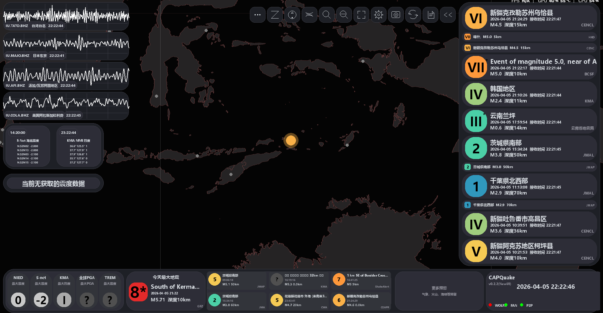
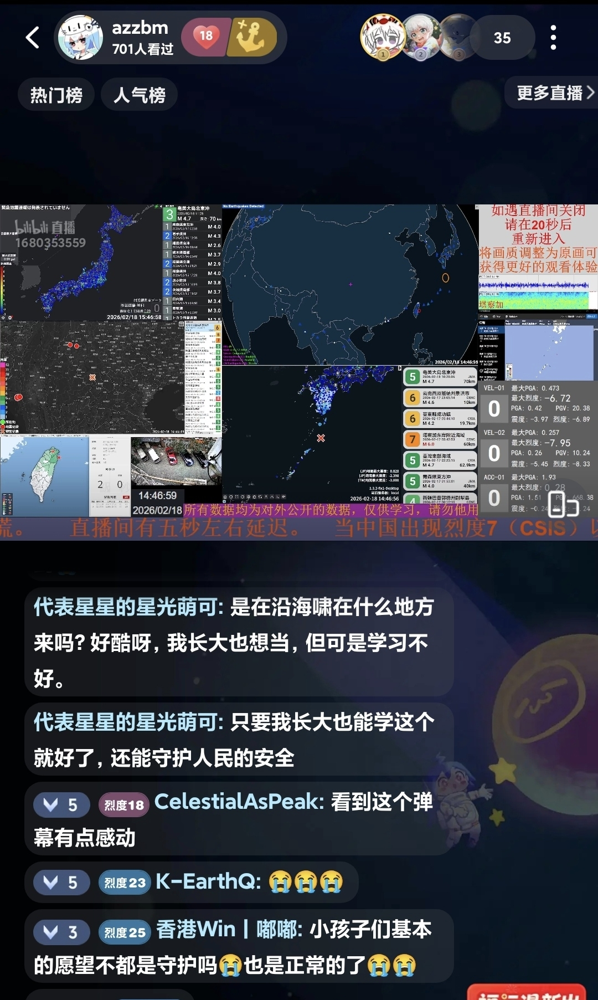

# CAPQuake — 全球地震震讯，地震预警与实时可视化以及气象，海啸，火山等综合灾讯整合平台


[](https://python.org)
[](https://pygame.org)
[](https://obspy.org)
[](LICENSE)
[](https://github.com/yourusername/CAPQuake)
[](https://github.com/yourusername/CAPQuake)
[](https://github.com/yourusername/CAPQuake)
[](https://www.python.org/dev/peps/pep-0008/)
[](http://makeapullrequest.com)


***此项目在快速迭代 功能在不断增加 预计后续内测后会完整公开***

***当前项目版本:0.2.2(Beta)***

> **“很不幸，我们没有能预警海啸来临的设备。这些设备都太贵了，我们没有钱来买。”**
>
> —— 印度尼西亚气象、气候和地球物理局的一位工作人员，2004 年印度洋地震与海啸之后。
>
> —— 2004 年印度洋地震与海啸造成约30万人遇难。


然而，这样的困境并非个例。从印度洋到太平洋，从非洲之角到拉丁美洲，全球各地区的地震与海啸监测能力参差不齐。发达国家拥有密集的测站网络和成熟的预警系统，而许多发展中国家却连最基本的震度计都难以覆盖。当灾害来临时，信息的不对称往往意味着生死之别。


**CAPQuake** 是一款基于 Python + Pygame + ObsPy 构建的专业级地震及其他灾情预警桌面应用程序。它从全球三十余个公开数据源实时接收地震信息和紧急地震速报，并包含气象、海啸、火山等预警模块，实现全球灾讯整合。

>技术应当是普惠的，预警的权利不应被国界与贫富所限制。

**可以前往我的bilibili主页，立刻观看项目最新运行效果:https://space.bilibili.com/1680353559**

- 基于开源精神，此项目会**全部开源**，并提供**中国国标标准版**和**完整版**。基于中国大陆的有关政策，推荐使用国标标准版，遵守中国大陆的法律法规。




## ✨ 项目特性

CAPQuake 的设计愿景是一个 **面向未来的多灾种综合态势集成平台** 与 **开源地震学工具链**。

### 🌍 更多功能 —— 从地震预警到多灾种融合
CAPQuake 的设计愿景是构建一个 **全球地震震讯、地震预警实时可视化以及气象、海啸、火山综合资讯整合平台**。当前已实现：

- **全球地震实时监测**：接入 USGS、CENC、JMA、EMSC、GFZ 等十余家机构的地震目录，覆盖全球。

| 源标识 (`source`) | 显示名称 | 说明 |
|------------------|----------|------|
| `cenc` | CENC | 中国地震台网中心 |
| `cenc-ir` | CENC | 中国地震台网烈度速报 |
| `cenc_list` | CENCL | CENC 地震列表 |
| `jma` | JMA | 日本气象厅地震情报 |
| `jma_list` | JMAL | JMA 地震列表 |
| `p2p_551` | JMAP | P2P 地震情報 |
| `usgs` | USGS | 美国地质调查局 |
| `usgs_feed` | USGSH | USGS 实时地震|
| `cwa` | CWA | 台湾中央气象署地震报告 |
| `cea` | CEA | 中国地震预警网 |
| `cea-pr` | CEAPR | 中国地震预警网省级融合源 |
| `sa` | ShakeAlert | 美国 ShakeAlert 预警 |
| `kma` | KMA | 韩国气象厅地震情报 |
| `kma-eew` | KMA | 韩国气象厅地震预警 |
| `ningxia` | 宁夏省地震局 | 宁夏回族自治区地震局速报 |
| `guangxi` | 广西省地震局 | 广西壮族自治区地震局速报 |
| `shanxi` | 山西省地震局 | 山西省地震局速报 |
| `beijing` | 北京市地震局 | 北京市地震局速报 |
| `yunnan` | 云南省地震局 | 云南省地震局速报 |
| `emsc` | EMSC | 欧洲地中海地震中心 |
| `fssn` | FSSN | FAN Studio Seismic Network |
| `usp` | USP | 巴西圣保罗大学地震中心 |
| `gfz` | GFZ | 德国地学研究中心 |
| `hko` | HKO | 香港天文台 |
| `bcsf` | BCSF | 法国中央地震研究所 |


- **紧急地震速报（EEW）**：支持 JMA、CWA、CEA、ShakeAlert、KMA 等预警源,预警范围覆盖中国大陆，中国台湾，日本，美国，韩国。

| 源标识 (`source`) | 显示名称 | 说明 |
|------------------|----------|------|
| `jma` | JMA | 日本气象厅紧急地震速报 |
| `cwa-eew` | CWA | 台湾中央气象署强震即时预警 |
| `cea` | CEA | 中国地震预警网 |
| `cea-pr` | CEA-pr | 中国地震预警网省级融合网 |
| `sa` | ShakeAlert | 美国 ShakeAlert 预警 |
| `kma-eew` | KMA | 韩国气象厅地震预警 |
| `p2p_556` | P2P | P2P 緊急地震速報 |

- **多类测站实时监控**：日本 NIED/Yahoo 强震、KMA PEWS、S-net 海底、全球 PGA 波形。

| 数据源 | 类型 | 说明 |
|--------|------|------|
| 強震モニタ | 实时震度 | 日本全国约 4000+ K-net测站 |
| KMA PEWS | 实时 MMI | 韩国气象厅实时测站 |
| S-net | 海底震度 | 日本海底地震观测网 |
| Obspy全球测站 | 波形 | 基于 ObsPy 从 EarthScope 获取波形 |
| Iris全球测站 | PGA/PGV | 基于 Iris 获取全球测站PGA/PGV |

- **预留扩展接口**：气象（台风、暴雨）、海啸、火山预警模块正在规划与集成开发中，将在0.3.0+版本实装。

| 数据源 | 提供的数据 |
|--------|------------|
| CMA中国气象局 | 国家气象灾害预警 |
| 香港天文台 | 海啸信息 |
| 自然资源部南海预报减灾中心 |  海啸警报 |
| 广西地震局 | 地震速报 |
|福建省海洋预报台|海啸警报|
|北京市地震局|地震速报|
|广东省海洋预报台|海啸警报|
| 俄罗斯科学院统一地球物理局 勘察加分部 | 地震目录，震源机制解|
| 古巴国家地震局 | 地震情报 | 
|泰国气象厅|地震信息|
|委内瑞拉地震研究基金会|地震情报|
印度国家海洋信息服务中心|海啸警报|
印度尼西亚海啸预警系统|海啸警报|
澳大利亚联合海啸预警中心|海啸警报|

### 🔧 更个性化，更开放 —— Python 生态的无限可能
- **纯 Python 实现**：基于 Python 3.8+，无需编译，修改即运行。任何熟悉 Python 的开发者都能轻松定制。
- **高度模块化**：数据获取、合并、渲染、UI 组件完全解耦。您可自由替换地图瓦片源、增删数据源、修改 UI 布局，甚至接入自己的预警算法。
- **配置驱动**：40+ 数据源独立开关，所有颜色、字体、布局参数均集中在 `config.py` 中，无需改代码即可深度定制外观与行为。
- **海量第三方库集成**：Pygame（图形）、ObsPy（地震信号处理）、Shapely（地理空间）、Pandas（数据分析）…… 您可利用这些库快速扩展新功能，例如震源机制解绘制、余震聚类分析等。

### 🧬 背靠 ObsPy —— 从展示软件跃升为专业地震学工具
ObsPy 是国际通用的地震学 Python 工具包，CAPQuake 深度集成 ObsPy，使其具备以下专业能力：

- **实时波形处理**：从 EarthScope 等数据中心获取原始波形，去除仪器响应，计算 PGA（峰值加速度），并映射为烈度与颜色。
- **专业级信号分析**：用户可调用 ObsPy 的滤波、频谱分析、震相拾取等功能，将 CAPQuake 变为实时地震学实验平台。
- **标准数据格式支持**：读写 SEED、SAC、MiniSEED 等格式，与主流地震学软件无缝对接。

### 📡 集成超多 API —— 开箱即用的全球数据源
- **地震情报**：FAN Studio（多源聚合）、Wolfx、P2P 地震情報、USGS、CENC、JMA、EMSC、GFZ、HKO、KMA 等。
- **预警**：FAN (JMA/CWA/CEA/SA/KMA)、Wolfx、P2P (556)。
- **测站烈度**：Yahoo 強震モニタ、KMA PEWS、S-net。
- **波形与 PGA**：EarthScope FDSN 全球台网。
- **海啸/气象**：香港天文台、印尼/澳大利亚海啸预警中心、OpenWeatherMap 等。

所有 API 均封装为独立模块，新增数据源只需编写一个解析函数并注册即可，工作量极小。

---


## 🌐 目前接入的数据源(会不断增加)
- 特别鸣谢 @LMG-LIVE 提供的大量新接口
- **常规数据源**:

| 数据源 | 提供的数据 |
|--------|------------|
| FAN Studio | 多源地震情报及紧急地震速报（EEW），国气象厅实时测站 MMI 数据 |
| Wolfx | 多源地震情报及紧急地震速报（EEW） |
| P2P | 日本地震情报及紧急地震速报（EEW）、震度速报 |
| USGS | 全球实时地震情报 |
| NIED 测站 | 日本实时震度观测点数据 |
| S-net 测站| 日本海底震度数据 |
| EarthScope  | 全球台站实时波形数据 |


- **特别数据源**:

| 数据源 | 提供的数据 |
|--------|------------|
| 香港天文台 | 海啸信息 |
| 自然资源部南海预报减灾中心 |  海啸警报 |
| 广西地震局 | 地震速报 |
|福建省海洋预报台|海啸警报|
|北京市地震局|地震速报|
|广东省海洋预报台|海啸警报|
| 俄罗斯科学院统一地球物理局 勘察加分部 | 地震目录，震源机制解|
| 古巴国家地震局 | 地震情报 | 
|泰国气象厅|地震信息|
|委内瑞拉地震研究基金会|地震情报|
印度国家海洋信息服务中心|海啸警报|
印度尼西亚海啸预警系统|海啸警报|
澳大利亚联合海啸预警中心|海啸警报|
## 🖥️ 系统要求

- **操作系统**：Windows 10/11（推荐）
- **Python**：3.8 或更高版本（建议 3.10+）
- **网络**：可能需要VPN以获取实时地震数据和波形（作者不用VPN一切正常 但开了体验会更好）

---

## 📦 快速开始

### 1. 克隆仓库

```bash
git clone https://github.com/yourusername/CAPQuake.git
cd CAPQuake
```
2. 本项目是在conda环境编写的。所以推荐使用conda环境。
```bash
#创建 Conda 环境
conda create -n capquake python=3.10
conda activate capquake
#安装核心依赖
conda install -c conda-forge obspy pygame shapely pandas numpy
pip install requests websocket-client openpyxl Pillow pytz
```

3. 如果您的电脑有C++的编写环境，那么可以一键安装Obspy,运行以下指令即可。
```bash
pip install pygame 
pip install obspy 
pip install requests 
pip install websocket-client 
pip install pandas 
pip install openpyxl 
pip install shapely 
pip install numpy 
pip install Pillow 
pip install pytz
```
4. 配置数据文件
将地图瓦片目录 tiles/ 放置在项目根目录（可运行 generate_tiles.py 生成，或下载预生成包）。

将行政区划 GeoJSON 文件放入 map/ 和 provinces/ 目录（参考 config.py 中的路径配置）。

如需使用 Excel 烈度数据，修改 config.EXCEL_INTENSITY_PATH。


## 🤝 贡献指南

欢迎提交 Issue 和 Pull Request。在贡献代码前，请确保：

1. 代码符合 PEP 8 规范（可使用 `black` 或 `ruff` 格式化）。
2. 新增功能需有相应文档和注释。
3. 提交前测试主要功能（数据接收、地图渲染、预警弹窗）。

---

## 📄 许可证

本项目基于 **MIT 许可证** 开源，详情见 [LICENSE](LICENSE) 文件。

---

## 🙏 致谢

- 特别鸣谢 （后完整再写致谢名单）
- 数据提供方：FAN Studio, Wolfx, P2PQuake等。

---

## 📧 联系方式

- 项目主页：[GitHub](https://github.com/yourusername/CAPQuake)
- 作者 Bilibili：[CelestialAsPeak](https://space.bilibili.com/1680353559)
- 作者邮箱1：celestialaspeak@outlook.com
- 作者邮箱2/相关技术交流：3420337181@qq.com

## 📖 后记

在项目开发期间，我曾在牢a直播间里看到几条弹幕：



**防灾减灾的种子，早已埋在了下一代的心里**。他们或许还不懂什么是地震波、什么是PGA，但他们知道——学习这些知识，将来可以守护更多的人。

CAPQuake 或许永远不会完美，但只要这个项目本身被赋予了温度，那这段代码就有了超越代码本身的意义。

**愿每一个守护人民的愿望，都不被辜负。**

---
