<div align="center">

# CAPQuake


[](https://python.org)
[](https://doc.qt.io/qtforpython-6/)
[](https://obspy.org)
[](https://www.opengl.org)
[](https://www.pygame.org)
[](https://requests.readthedocs.io)
[](https://numpy.org)
[](https://python-pillow.org)
[](https://pypi.org/project/zhconv)

</div>

---

CAPQuake 是一款开源的地震与其它灾害预警桌面应用,将全球大量数据源汇聚于一张地图,持续监测全球范围内地震、海啸、台风与火山灾害情况。


# 数据源

CAPQuake 的数据来自全球 46 路数据源,官方机构为主、第三方聚合为辅。每个数据源都可以在设置中独立开关,并按震级与烈度过滤。

### 地震预警

| 数据源 | 中文名 | 来源 |
|---|---|---|
| JMA-EEW | 日本气象厅 紧急地震速报(予报，警报) | Wolfx |
| JMA-EEW-Special | 日本气象厅 紧急地震速报(警报) | P2PQuake API |
| SC | 四川省地震局 地震预警 | Wolfx |
| CQ | 重庆市地震局 地震预警 | Wolfx |
| CEA | 中国地震预警网地震预警 | CAPQHT API,Wolfx |
| CEA-PR | 中国地震预警网省级网地震预警 | CAPQHT API |
| CWA-EEW | 台湾中央气象署强震即时预警 | CAPQHT API, Wolfx |
| ShakeAlert | ShakeAlert® Earthquake Early Warning (EEW) System | CAPQHT API |
| Early-est | INGV 全球快速定位地震预警系统 | |
| SASMEX | 墨西哥地震预警 | |


### 地震测定

| 数据源 | 中文名 | 来源 |
|---|---|---|
| CENC | 中国地震台网 地震报告 | CAPQHT API，Wolfx |
| CENC-INT | 中国地震台网 烈度速报 | NowQuake CENC 烈度速报 API |
| JMA | 日本气象厅 地震情报 | P2PQuake API |
| JMA-LPGM | 長周期地震動に関する観測情報 ||
| Hi-net | NIED Hi-net 震源情报 | |
| Hi-net AUQA-MT | NIED AUQA-MT 震源机制解 | |
| F-net | NIED F-net 震源机制解 | |
| K-NET · KiK-NET | NIED K-NET · KiK-NET地震事件报告 | |
| NIED RISQ | NIED RISQ 地震速报 |  |
| CWA | 台湾中央气象署 地震报告 | CAPQHT API |
| P-Alert Strong Monitor Network | P-Alert 地震事件测站观测情报 | |
| USGS | 美国地质调查局 地震报告 | |
| USGS-CMT | 美国地质调查局 震源机制解 | |
| USGS-ShakeMap | 美国地质调查局 ShakeMap摇晃地图,测站烈度报告 | |
| USGS-DYFI | 美国地质调查局 社区有感地震上报报告 | |
| EMSC | 欧洲地中海地震中心 地震报告 | |
| EMSC[XX] | 欧洲地中海地震中心合作机构 地震报告 | |
| EMSC-CMT | 欧洲地中海地震中心 震源机制解 | |
| EMSC[XX]-CMT | 欧洲地中海地震中心合作机构 震源机制解 | |
| EMSC-DYFI | 欧洲地中海地震中心 社区有感地震上报报告 | |
| AUST | 澳大利亚地球科学局 地震报告 | |
| BEO | 塞尔维亚地震调查局 地震报告 | |
| BGS | 英国地质调查局 地震报告 | |
| BUD | 匈牙利地震台网 地震报告 | |
| GFU | 捷克科学院地球物理研究所 地震报告 | |
| GSRAS | 俄罗斯科学院地球物理调查局 地震报告 | |
| IAG | 蒙古天文学与地球物理研究所 地震报告 | |
| IGC | 巴拿马大学 地震报告 | |
| IGN | 西班牙国家地理研究所 地震报告 | |
| INGV | 意大利国家地球物理与火山学研究所 地震报告 | |
| IPMA | 葡萄牙海洋与大气研究所 地震报告 | |
| KOERI | 土耳其坎迪利天文台与地震研究所 地震报告 | |
| LED | 德国巴登-符腾堡州地质矿产局 地震报告 | |
| MCSM | 乌克兰特殊监测主中心 地震报告 | |
| MLT | 马耳他大学地震台网 地震报告 | |
| NDI | 印度气象局 地震报告 | |
| NIEP | 罗马尼亚国家地球物理研究所 地震报告 | |
| NORSAR | 挪威地震台阵 地震报告 | |
| RSSC | 阿塞拜疆共和国地震调查中心 地震报告 | |
| TRN | 特立尼达和多巴哥西印度群岛大学 地震报告 | |
| YSVOC | 也门地震与火山观测中心 地震报告 | |
| GFZ(GEOFON) | 德国地学研究中心 地震报告 | |
| GeoNet | 新西兰地质灾害监测网 地震报告 | |
| GeoNet-ShakeMap | 新西兰地质灾害监测网 摇晃地图,测站烈度报告 | |
| BMKG | 印度尼西亚气象，气候和地球物理局 地震报告 | |
| BMKG-DYFI | 印度尼西亚气象，气候和地球物理局 社区有感地震上报报告 | |
| HKO | 香港天文台 地震报告 | |
| HKO-DYFI | 香港天文台 居民社区有感地震上报报告 | |
| PHIVOLCS | 菲律宾火山地震研究所 地震报告 | |
| CSNC | 智利大学 地震报告 | |
| TMD | 泰国地震局 地震报告 | |
| CENAIS | 古巴国家地震局 地震报告 | |
| FUNVISIS | 委内瑞拉国家地震局 地震报告 | |
| NRCan | 加拿大自然资源部 地震报告 | |
| USP | 巴西圣保罗大学 地震报告 | |
| COLOMBIAN | 哥伦比亚国家地震局 地震报告 | |
| EGYPT | 埃及国家地震局 地震报告 | |
| KMA | 韩国气象厅 本土及远土地震报告 | |
| BCSF | 法国中央地震研究所 本土及远土地震报告 | |
| FSSN | FSSN 地震报告 | Fan Studio API |

### 测站网络

| 数据源 | 中文名 | 来源 | 测站数量 |
|---|---|---|---|
| NIED |  K-NET,KiK-net NIED 日本陆上测站观测网 | KMONI | 1734|
| NIED S-Net |  NIED 日本海沟海底地震海啸观测网 |  | 150 |
| P-Alert | P-Alert 观测网 | | 785 |
| KMA-PEWS | 韩国气象厅 测站观测网 | | 550 |
| EarthScope SeedLink | EarthScope 全球测站(23 台网) | | 961 |
| GEOFON SeedLink | GEOFON 全球测站(3 台网) |  | 77 |
| Kwatch-24h | 日本终端振动感知网络(振動レベル) | | |


### 海啸预警

| 数据源 | 中文名 | 来源 |
|---|---|---|
| NMEFC | 中国自然资源部 海啸预警中心 | |
| JMA-TSUNAMI | 日本气象厅 海啸予报(若干的海面变动),海啸注意报,海啸警报,大海啸警报 | |
| PTWC | 太平洋海啸预警中心 海啸预警| |
| NTWC | 美国国家海啸预警中心 海啸预警| |
| GDACS-TSUNAMI | 全球灾害警报与协调系统 海啸预警 | |
| JATWC | 澳大利亚联合海啸预警中心 海啸预警| |
| InaTEWS | 印度尼西亚海啸预警系统 海啸预警| |
| INCOIS | 印度国家海洋信息服务中心 海啸预警 | |
| CENALT | 法国海啸预警中心 海啸预警| |
| CAT-INGV | 意大利国家地球物理与火山学研究所 海啸预警 | |
| NOA | 雅典国家天文台 希腊海啸预警 | |
| KOERI(RETMC) | 坎迪利天文台与地震研究所 土耳其国家海啸预警| |
| IPMA | 葡萄牙海洋与大气研究所 国家海啸预警| |

### 海啸观测情报

| 数据源 | 中文名 | 来源 |
|---|---|---|
| PTWC | 太平洋海啸预警中心 验潮站实测波高观测点 | |
| NTWC | 美国国家海啸预警中心 验潮站实测波高观测点 | |
| GDACS | 全球范围 验潮站实测波高观测点 | |

### 火山预警

| 数据源 | 中文名 | 来源 |
|---|---|---|
| JMA-VOLCANO | 日本气象厅 火山情报 | |
| GeoNet-VOLCANO | 新西兰地质灾害监测网 火山情报 | |

### 其它

**台风**

| 数据源 | 中文名 | 来源 |
|---|---|---|
| CMA | 中国气象局 台风情报 | |
| JMA | 日本气象厅 台风情报 | |

**天气**

| 数据源 | 中文名 | 来源 |
|---|---|---|
| 全国雷达组合反射率 | 中国气象局 | CAPQHT API |
| 全国降水图层 | 中国气象局 | CAPQHT API |
| 国家气象灾害预警 | 中国气象局 | |

---

*数据版权归各源机构所有，请遵守每个数据源的使用条款，后续数据源可能会随着版本变更而增加或减少。*


# 功能介绍

常规功能在此不再赘述，此板块主要介绍CAPQuake的特色功能。

### 负一屏

为了更方便用户可视化，我们将屏幕左侧改造成了负一屏专属区域，设计参考了IPad的负一屏设计逻辑，支持自定义组件，组件交互，组件个性化设置，拖拽改变位置等等。也可以自选关闭负一屏。
等待项目基础功能完善后，我们会重点开发负一屏的相关组件，同时支持插件扩展并提供简单的插件手册与md，方便用户自定义。

*下列效果展示图以波形组件为例，支持自定义尺寸，改变位置与自选全球900+实时台站波形。*

<div align="center">

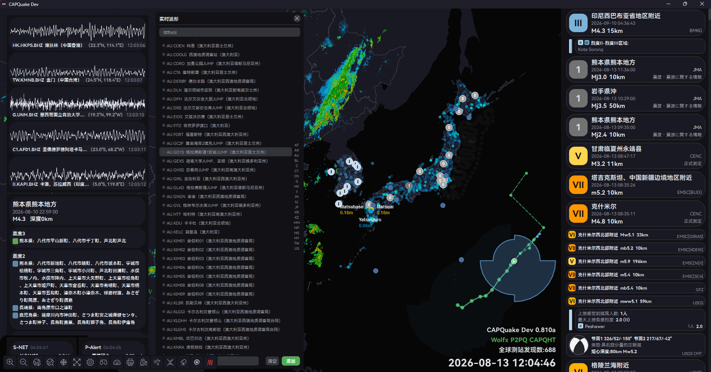

</div>

### 全球测站与波形

项目支持实时查看EarthScope26台网与GEOFON3台网的全部测站实时情况，同时可以通过波形组件自定义查看具体单个测站的波形。CAPQuake会实时计算测站的PGA(如果支持)，PGV,PGD,LPGD,并拟合成震度与CSIS.

<p align="center">
  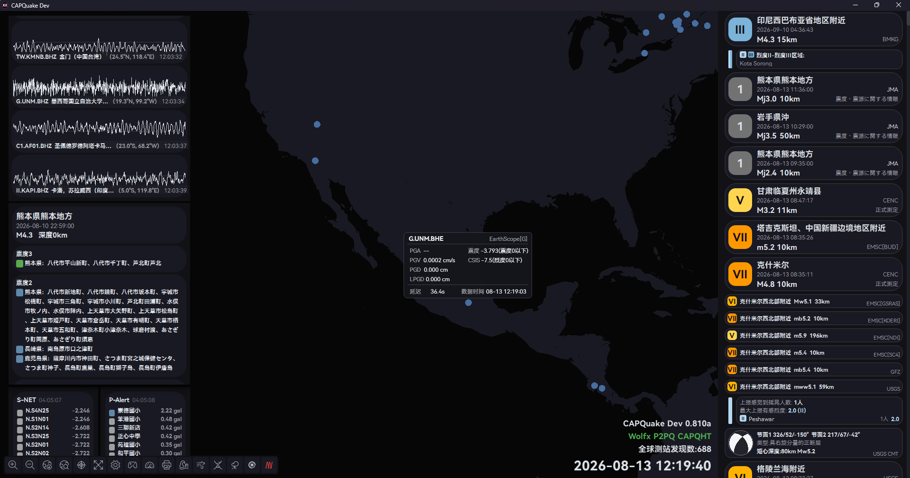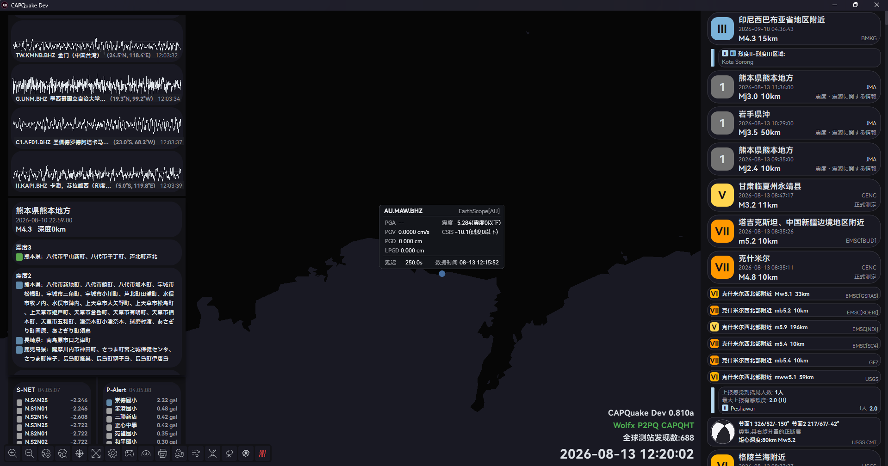
</p>

### 海啸模式

海啸模式支持查看日本范围内的海啸预警历史，以及全球范围内，从2000年至今的海啸预警与观测波高历史记录。

*下列效果展示图内容为2024年日本能登半岛7.4级地震海啸预警，2025年俄罗斯勘察加8.8级巨大地震的海啸预警与观测波高，2004年印度洋9.3级巨大地震的海啸预警与观测波高情况。*

<p align="center">
  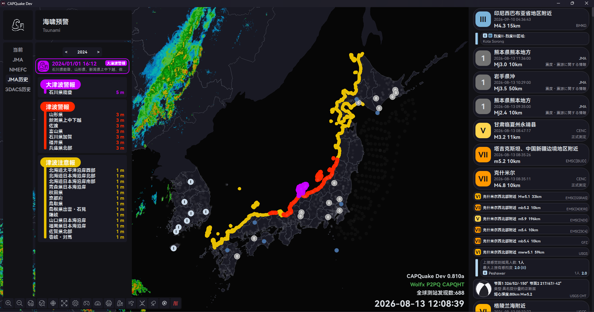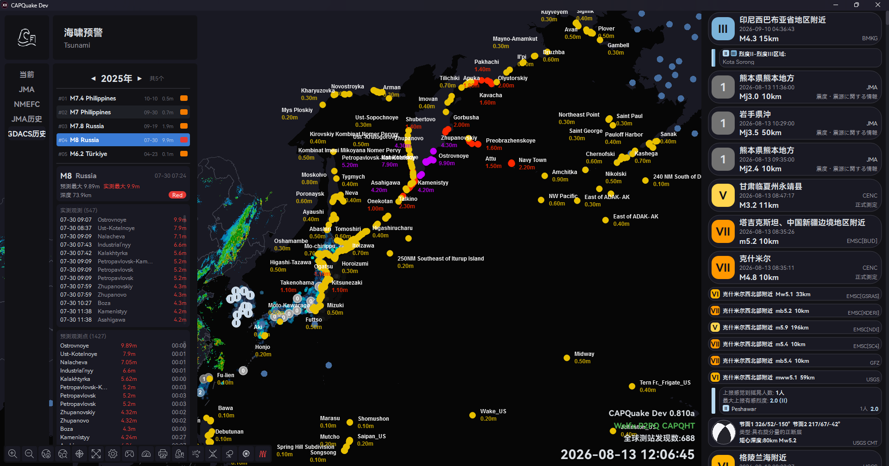
</p>

<div align="center">

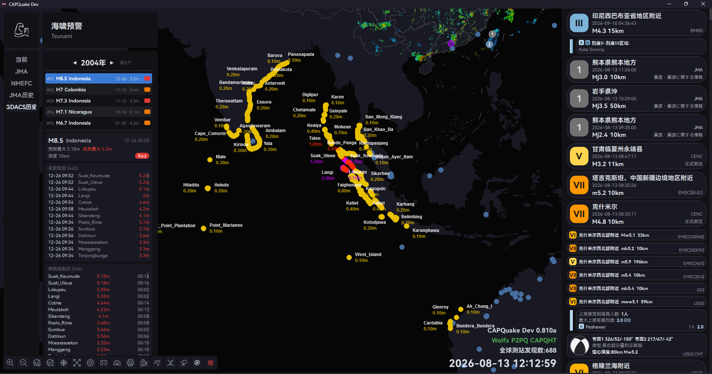

</div>

### 台风模式

台风模式支持实时查看台风路径与风圈，支持CMA与JMA预报源。同时收录了CMA 77 年历史台风档案。

<p align="center">
  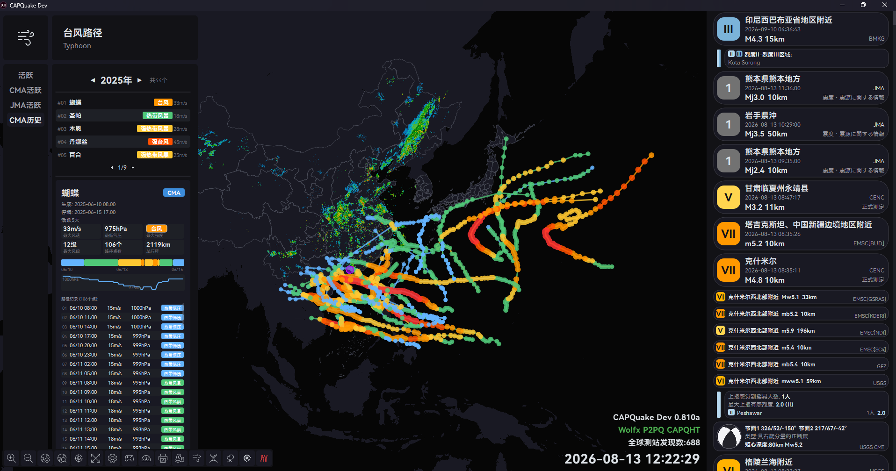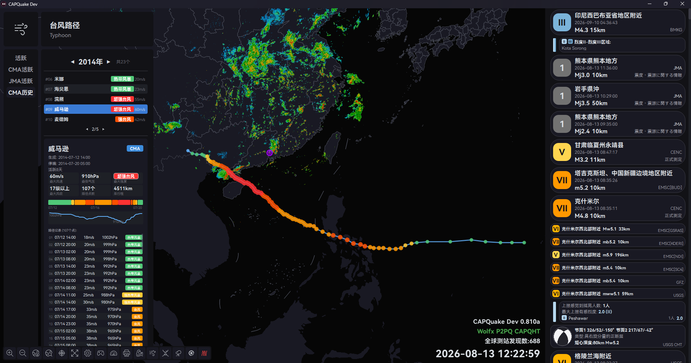
</p>

### 有感地震报告

除了机构测定，CAPQuake 还收录居民社区的有感上报。USGS DYFI、EMSC、BMKG 与 HKO 的社区上报以逐点色标绘制在地图上，颜色对应震感强弱；中国地震台网烈度速报提供逐站仪器烈度，单个事件可覆盖数百个测站；日本 Kwatch-24h 以全国联网终端实时统计振动等级，JMA 長周期地震動以阶级色块呈现。

<p align="center">
  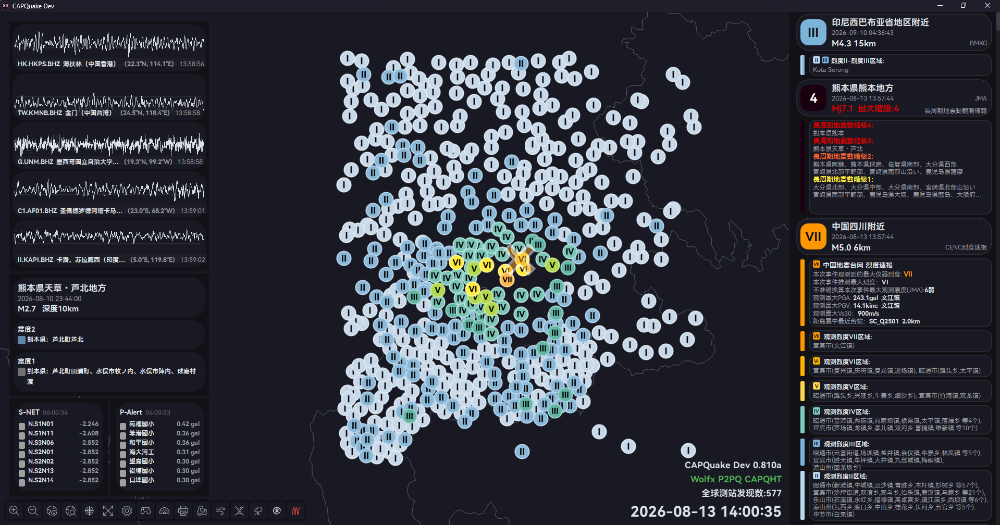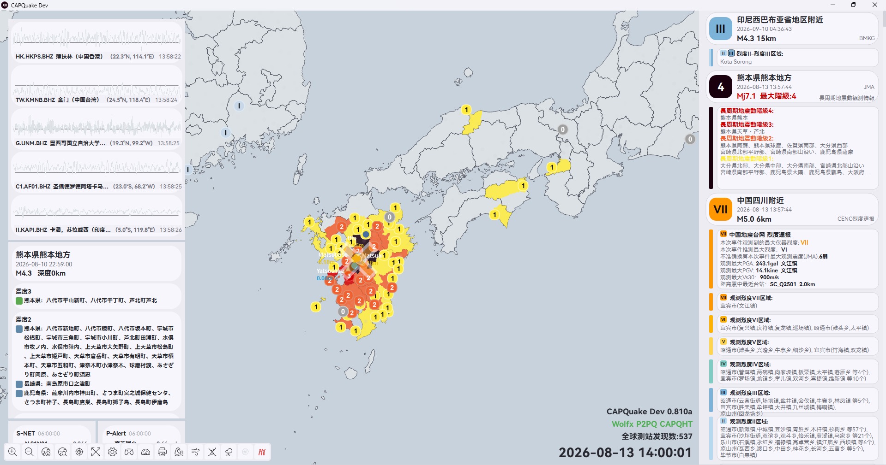
</p>

<div align="center">

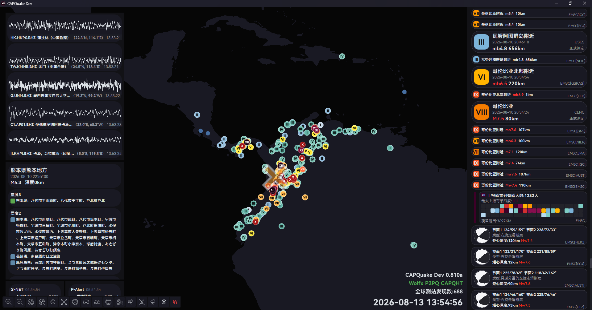

</div>

### ShakeMap，GeoNet台站观测情报

USGS ShakeMap 将等值线、与逐站实测烈度完整落到地图，点击卡片即见；GeoNet 提供同款摇晃地图与强震动台站观测，按烈度降序展示；台湾 P-Alert 以 785 座测站的逐站 PGA / PGV 呈现事件观测全貌。

<p align="center">
  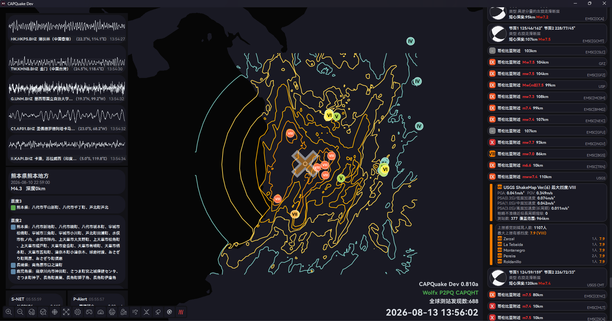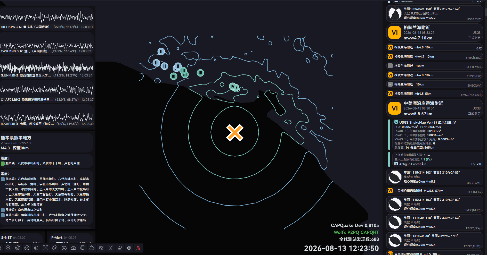
</p>

<div align="center">

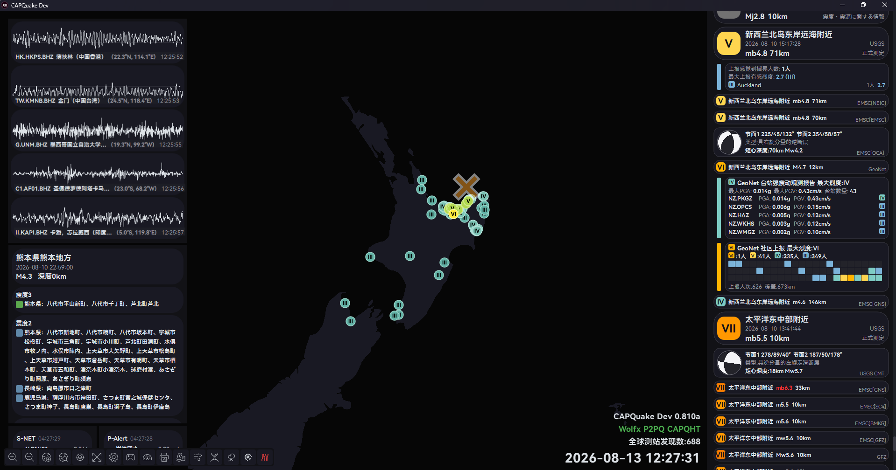

</div>

### 开发中模式

以下模式仍在开发中 将会在后续版本上线

* 火山模式
* 回放模式


# 安装

系统要求：Windows 10 / 11，需要网络连接。

只想使用软件：走**方式一**，CAPQuake会提供打包版。如果是开发者想改编或贡献PR：走**方式二**。

## 方式一：打包版

1. 在发布页面下载压缩包
2. 解压到任意文件夹，**路径不要包含中文**
3. 双击 `CAPQuake.exe`，等启动画面结束，出现地图窗口即成功

打包版自带运行环境，无需安装 Python。更新时重新下载新版覆盖即可。

## 方式二：源码运行

### 1. 安装 Python

到 [python.org/downloads](https://www.python.org/downloads/) 下载 **3.10 以上**版本。安装时**务必勾选 “Add Python to PATH”**，否则后面的命令都会提示找不到。

装好后按 `Win + R`，输入 `cmd` 回车，在命令行里验证：

```bash
python --version
```

输出 `Python 3.x.x` 即为成功。

### 2. 下载代码

任选其一：

- **有 Git**：在命令行执行

```bash
git clone https://github.com/CelestialAsPeak/CAPQuake.git
```

- **没有 Git**：在仓库页面点 `Code → Download ZIP`，解压到任意位置

### 3. 创建虚拟环境


```bash
cd CAPQuakeQt_0.5
python -m venv venv
.\venv\Scripts\activate
```

命令行提示符前出现 `(venv)` 即进入成功。以后每次启动项目前，都要先激活一次。


### 4. 安装依赖

```bash
pip install -r requirements.txt
pip install pygame>=2.6
```

也可选择国内镜像：

```bash
pip install -r requirements.txt -i https://pypi.tuna.tsinghua.edu.cn/simple
pip install pygame>=2.6 -i https://pypi.tuna.tsinghua.edu.cn/simple
```

### 5. 启动

```bash
python run.py
```

看到启动画面并最终出现地图窗口即成功。运行日志在 `logs/` 目录，配置保存在系统注册表。

## 常见问题

**Q：遇到问题/BUG，怎么办？**
打开 `logs/` 里最新的日志文件，截图提交issus或咨询作者。

**Q：启动后地图一直没有数据？**
先确认网络正常；首次启动要拉一批历史数据，需要等一会儿。Windows 防火墙弹窗请点“允许”。

**Q：首次启动很慢？**
正常，首次要拉历史数据、生成地图缓存，第二次会快很多。

**Q：卡顿怎么办？**
CAPQuake非常吃CPU,如果出现卡顿，请检查CPU占用是否过高。如果还是不行，请运行CAPQuake Lite版本(后续上线)。

**Q：（临时）如何参加内测？**
我们正在搭建答题网站，通过答题后即可参加内测。


