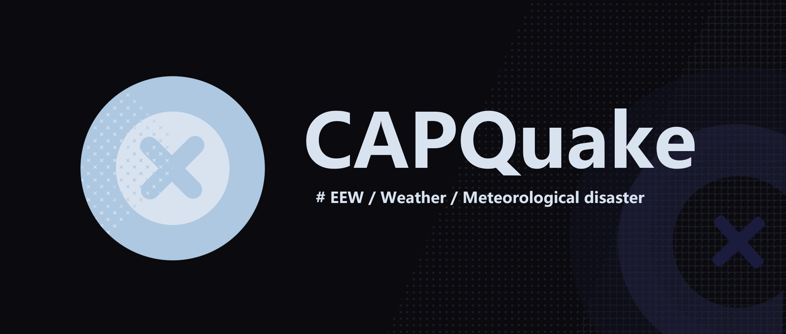
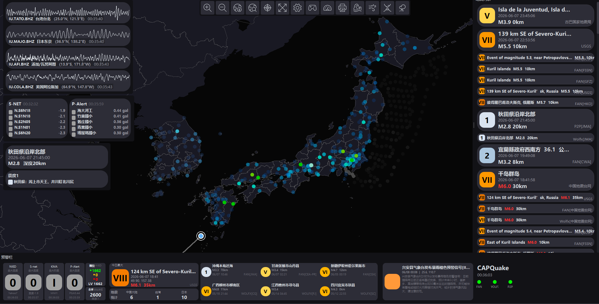
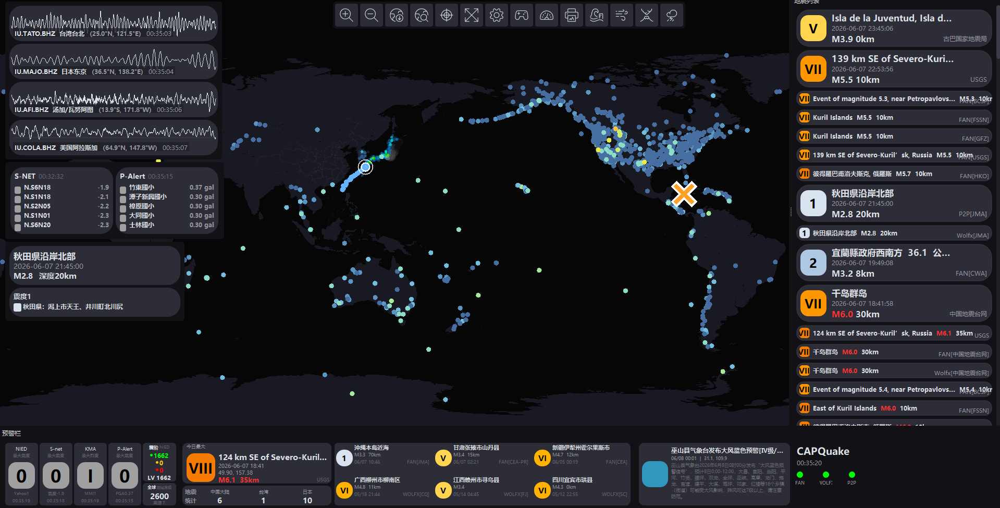
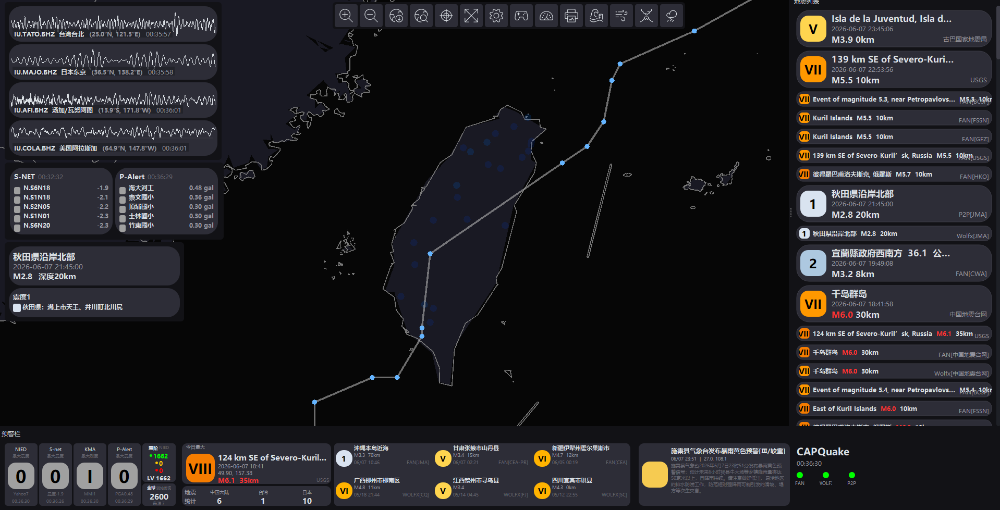
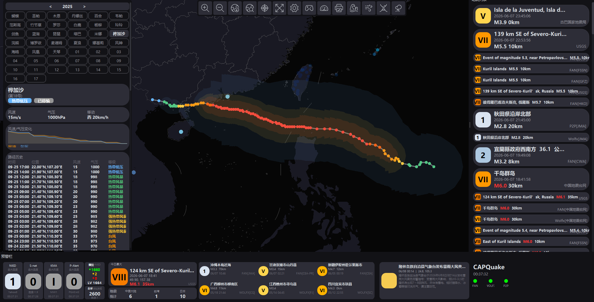

<div align="center">

# CAPQuake Project



[](https://python.org)
[](https://doc.qt.io/qtforpython-6/)
[](https://obspy.org)
[](LICENSE)
[](https://github.com/yourusername/CAPQuake)
[](https://github.com/yourusername/CAPQuake)
[](https://github.com/yourusername/CAPQuake)


</div>
<div align="center">

 **关于CAPQuake Project**

<table>
<tr>
<td width="70%">

>
> **CAPQuake** 是一款开源的基于 **Python + PySide6 + ObsPy** 构建的地震，气象及其他灾情预警桌面应用程序。
> 接入了FAN Studio API,Wolfx等10+**第三方数据源**以及CMA,USGS,GeoNet等30+**官方数据源**。
>
>由 ** Python 开发**，采用了模块化设计，方便其他开发者**个性化改编**及制作插件。 更基于Obspy,Metradar等python强大的科学计算库，开发了 **CAPSPPE自动震源机制解**，**震源自动推算**等功能。

</td>
<td width="30%">

观看最新项目开发进程及运行效果:
<div align="center">

**[](https://space.bilibili.com/1680353559)  [](https://github.com/yourusername/CAPQuake)**

</td>
</tr>
</table>


**CAPQuake Project 系列项目**

<table>
<tr>
<td width="70%">

>
> 针对不同的需求，CAPQuake Project设共有3种不同版本的CAPQuake：
> 
> 1.**CAPQuake-Lite**
> 为了性能而设计的版本，具备基础的地震及海啸预警功能。
> 
> 2.**CAPQuake-CAPSPPE**
> 功能最多的版本。除了地震预警外，集成了气象，火山等更多预警功能，以及震源推算，差补时震源推算，CAPSPPE自动震源机制解等。还包括地震，台风模拟。
> 
> 3.**CAPQuake-Playground**
> 专门把地震，台风模拟功能独立出来的一个版本。适合只对地震，台风模拟有兴趣的人。
>

</td>
<td width="30%">

版本连接:

**[](
  https://github.com/CelestialAsPeak/CAPQuake-Lite)**

**[](https://github.com/CelestialAsPeak/CAPQuake-Playground)**

**[](https://github.com/CelestialAsPeak/CAPQuake-CAPSPPE)**

开源协议:

**[](https://github.com/CelestialAsPeak/CAPQuake-Lite/blob/main/LICENSE)**


</td>
</tr>
</table>

---

**注意事项**

> 
> 这个项目目前**还没公开**,目前正在进行**代码二审工作**以及**性能优化**
>
> 请不要再下载**仓库里空的代码文件**，那些是作者没钱时，为了临时写一些小功能，方便Web端AI搞清架构而上传的**空壳文件**
> 
> (作者甚至在文件内用**From**这种逆天代码暗示了这些文件**根本没法运行**)

```bash
# 摘自CAPSPPE/IPF/Docall.txt
# 这些运行不了！这些运行不了！这些运行不了！
From CAPQuake.IPF.Core import HypocenterInversionEngine
From CAPQuake.IPF.Inversion import DoubleDifferenceSolver
```
</div>

---

## ✨ 项目亮点   /   🖥️ 界面预览 

<div align="center">


<table>
<tr>
<td width="50%">



</td>
<td width="50%">

**💻日本NIED K-Net/KIK-Net测站网 / S-Net海底测站网 / 韩国KMA-PEWS测站**

依赖数据源:

**NIED**  Yahoo Japen 气象接口

**NIED 精确测站位置 地表PGA/PGV 及其他数据** Two MONI

**S-Net 海底测站** 日本海MSIL(3分钟更新1次)

**韩国KMA-PEWS测站** FSSN

</td>
</tr>
</table>


<table>
<tr>
<td width="50%">

**🌐全球5000+测站震度显示**

服务器列表：

**EarthScope 主服务器台网** 60+台网

**GFZ 台网** 30+台网

**GEONET,RESIF,IPGP台网**  6台网

**BGR,AusPass,SNAC NOA台网**  6台网

由于连接不稳定，测站显示可能会有延迟，图片展示效果为CAPQuake 限制链接2600个台站的效果。

</td>
<td width="50%">



</td>
</tr>
</table>


<table>
<tr>
<td width="50%">



</td>
<td width="50%">


**💯台湾P-Alert测站**

P-Alert观测网是由P-Alert地震P波感测仪所构成的即时地震观测网，具有地震预警及产出等震度图的功能。

由于数据源本身原因，测站数据可能会延迟几秒。

</td>
</tr>
</table>


<table>
<tr>
<td width="50%">

**🌈台风/火山情报**

接入了CMA/中国气象局官方台风路径，并以FSSN历史台风路径为备用，实时显示最新台风路径。
并显示出影响范围。

接入了JMA/日本气象厅火山预警情报。

</td>
<td width="50%">



</td>
</tr>
</table>


<table>
<tr>
<td width="50%">

**📦CAPSPPE 自动震源机制解，震源推算**

基于OBSPY与全球测站，自动分析全球M5以上的震源机制解。

(该功能还在开发/实验)

</td>
<td width="50%">

**🎢台风/地震/火山模拟**

模拟了IPF法的震源推断和PLUM法的地震预警，同时，CAPSPPE支持基于全球真实测站位置与用户自己随机生成的测站进行震源推断与地震预警。全球测站（模拟）也会根据模拟的地震参数产生模拟反应。

此外，CAPQuake还新增了台风模拟，目前可以模拟台风季（5-9月）随机生成台风。并且可以生成台风详细数据，路径自动推算以及多台风效应干扰。也支持用户手动生成台风并自定义台风参数。

(以上功能均还在早期，正在不断迭代开发)
</td>
</tr>
</table>

</div>


## 🔧 技术架构

### 核心技术栈

| 组件 | 技术 | 用途 |
|:------:|:------:|:------|
| **UI 框架** | PySide6 (Qt 6) | 现代化跨平台桌面界面 |
| **地震学引擎** | ObsPy | 波形处理、信号分析、SEED/SAC 格式支持 |
| **图形渲染** | PyOpenGL | 地图与波形渲染 |
| **数据处理** | Pandas + NumPy | 数据分析与数值计算 |
| **地理空间** | Shapely | 地理空间数据处理 |

---

## 🌐 数据源矩阵

### 地震测定情报源

*为了保证部分地震测定数据源的稳定性，CAPQuake会以CAPQHT json数据为备用数据源，二者混用。

*实际请求数据时请留意数据来源的使用政策，避免过度请求导致对服务器造成较大压力。

*CAPQHT json目前还在试验阶段，不保证稳定性

| 数据类型/来源 | 源标识 | 显示名称 | 协议 | 说明 |
|:------:|:--------:|:----:|:------|:------|
| CENC官方 / FAN Studio API / Wolfx | `cenc` | CENC | HTTP/WSS | 中国地震台网自动测定/正式测定 |
| FAN Studio API | `cenc-ir` | CENC | WSS | 中国地震台网烈度速报 |
| P2P/Wolfx | `jma` | JMA | WSS | 日本气象厅地震情报 |
| USGS官方/FAN Studio API | `usgs` | USGS | HTTP/WSS | 美国地质调查局地震情报 |
| EMSC官方/FAN Studio API | `emsc` | EMSC | HTTP/WSS | 欧洲地中海地震中心地震情报 |
| GFZ官方/FAN Studio API | `gfz` | GFZ | WSS | 德国地学研究中心地震情报 |
| GeoNet官方 | `geonet` | GeoNet | HTTP | 新西兰地质地质灾害监测网地震情报 |
| FAN Studio API | `kma` | KMA | WSS | 韩国气象厅地震情报 |
| FAN Studio API | `cwa` | CWA | WSS | 台湾中央气象署地震情报 |
| HKO官方/FAN Studio API | `hko` | HKO | HTTP/WSS | 香港天文台地震情报 |
| BCSF官方/FAN Studio API | `bcsf` | BCSF | WSS | 法国中央地震研究所地震情报 |
| NRCan官方 | `nrcan` | NRCan | HTTP | 加拿大自然资源部地震情报 |
| Funvisis官方 | `funvisis` | FUNVISIS | HTTP | 委内瑞拉地震研究基金会地震情报 |
| SENAIS官方 | `cenais` | CENAIS | HTTP | 古巴国家地震局地震情报 |
| FAN Studio API | `usp` | USP | WSS | 巴西圣保罗大学地震情报 |
| FAN Studio API | `fssn` | FSSN | WSS | FSSN 地震速报 |
| 俄罗斯勘察加地球物理研究所 | `ru-kcj` | RUKCJ | HTTP | 俄罗斯勘察加地球物理研究所地震目录 |
| 泰国地震局 | `tmd` | TMD | HTTP | 泰国地震局地震测定 |
| 菲律宾火山地震研究所官方 | `phivolcs` | PHIVOLCS | HTTP | 菲律宾火山地震研究所地震测定 |
| 智利大学地震中心 | `csnc` | CSNC | HTTP |智利大学地震中心地震测定 |
| 印度尼西亚气象、气候和地球物理局 | `bmkg` | BMKG | HTTP | 印度尼西亚气象、气候和地球物理局地震测定,烈度速报 |

### 紧急地震速报 (EEW)

| 源标识 | 显示名称 | 预警名称 |
|:------:|:--------:|:--------:|
| `jma` | JMA | 日本气象厅紧急地震速报 |
| `cwa-eew` | CWA | 台湾中央气象署强震即时预警 |
| `cea` | CEA | 中国地震预警网(M>=4.0) |
| `cea-pr` | CEA-pr | 中国地震预警网省级融合源(M>=3.0) |
| `sa` | ShakeAlert | 美国西海岸地震预警网 |
| `kma-eew` | KMA | 韩国气象厅紧急地震速报 |
| `earlyest` | Earlyest | INGV 境外地震速报 |
| `globalquake` | GlobalQuake | GlobalQuake地震预警 |

### 气象与海啸

| 数据源 | 类型 | 说明 |
|:------:|:----:|:------|
| CMA 中国气象局 | 气象预警 | 国家气象灾害预警 |
| CMA 中国气象局 | 台风预警 | 台风预警 |
| 香港天文台 | 海啸信息 | 南海海啸监测 |
| 自然资源部南海预报减灾中心 | 海啸警报 | 南海区域预警 |
| 福建省海洋预报台 | 海啸警报 | 台湾海峡区域 |
| 广东省海洋预报台 | 海啸警报 | 南海北部区域 |
| 印度国家海洋信息服务中心 | 海啸警报 | 印度洋区域 |
| 印度尼西亚海啸预警系统 | 海啸警报 | 印度洋区域 |
| 澳大利亚联合海啸预警中心 | 海啸警报 | 印度洋/太平洋区域 |
| PTWC | 海啸警报 | 太平洋海啸预警中心 |
| 菲律宾火山地震研究所 | 海啸警报 | 菲律宾海啸预警 |
| 印度尼西亚气象、气候和地球物理局 | 海啸警报 | 印度尼西亚海啸预警 |


---

## 📦 快速开始/开发者如何安装并改编？

### *作者会提供好打包好的版本，以下教程为针对开发者的

### 系统要求

- **操作系统**: Windows 10/11 (推荐), Linux, macOS
- **Python**: 3.10 或更高版本
- **网络**: 无

### 安装步骤


#### 1. 克隆仓库

```bash
git clone https://github.com/yourusername/CAPQuake.git
cd CAPQuake/CAPQuakeQt_0.5
```

#### 2. 创建虚拟环境 (推荐 Conda)

```bash
# 使用 Conda
conda create -n capquake python=3.10
conda activate capquake

# 或使用 venv
python -m venv venv
# Windows
.\venv\Scripts\activate
# Linux/macOS
source venv/bin/activate
```

#### 3. 安装依赖

```bash
# 一键安装
pip install -r requirements.txt

# 或手动安装核心依赖
pip install PySide6>=6.5.0 obspy>=1.5.0 PyOpenGL>=3.1.0 zhconv>=1.4.0 requests>=2.25.0
```

#### 4. 启动应用

```bash
# 方式一：Python 模块启动
python -m ui.app

# 方式二：使用启动脚本 (Windows)
.\start.ps1

# 方式三：使用批处理 (Windows)
.\start.bat
```


---

## 🧪 测试与验证

```bash
# 运行集成测试
python -m pytest tests/

# 测试 EEW 生成器
python core_service/test_eew_generator.py

# 测试数据源连接
python data/test_ears.py
```

---

## ⚙️ 配置说明

### 数据源配置

所有数据源开关集中在 `core_service/settings.py` 中，可通过 UI 设置对话框修改：

```python
DEFAULTS = {
    "sources/fan/enabled": True,
    "sources/wolfx/enabled": True,
    "sources/p2p/enabled": True,
    "sources/usgs/enabled": True,
    # ... 更多数据源
}
```

### 显示过滤

支持按震级和烈度过滤显示：

```python
"filter/usgs/min_magnitude": 4.0,
"filter/usgs/min_intensity": 3.0,
```

### SeedLink 配置

```python
"seedlink/max_stations": 3000,  # 最大测站数量
```

---

## 🤝 贡献指南

欢迎提交 Issue 和 Pull Request！在贡献代码前，请确保：

1. 代码符合 PEP 8 规范（可使用 `black` 或 `ruff` 格式化）
2. 新增功能需有相应文档和注释
3. 提交前测试主要功能（数据接收、地图渲染、预警弹窗）
4. 新增数据源需在 `core_service/parsers/` 下添加解析器，并在 `dispatcher.py` 中注册

### 自定义添加新数据源

1. 在 `data/connectors/` 下创建连接器
2. 在 `core_service/parsers/` 下创建解析器
3. 在 `core_service/dispatcher.py` 中注册信号映射
4. 在 `core_service/settings.py` 中添加开关配置
5. 在 `ui/widgets/settings_dialog.py` 中添加 UI 控件

---

## 📄 许可证

本项目基于 **MIT 许可证** 开源，详情见 [LICENSE](LICENSE) 文件。

---

## 🙏 致谢

- **数据提供方**: FAN Studio API, Wolfx Open API , P2P 地震情報等
- **特别鸣谢**: 
- **开源社区**: PySide6, ObsPy, Shapely, Pandas, NumPy 等优秀开源项目

---

## 📧 联系方式

<div align="center">

[](https://space.bilibili.com/1680353559)
[](https://github.com/yourusername/CAPQuake)
[](mailto:celestialaspeak@outlook.com)

</div>

---

<div align="center">

**CAPQuake Readme版本** — Qt 0.532

*CAPQuake 开发中 暂未公开*

</div>
